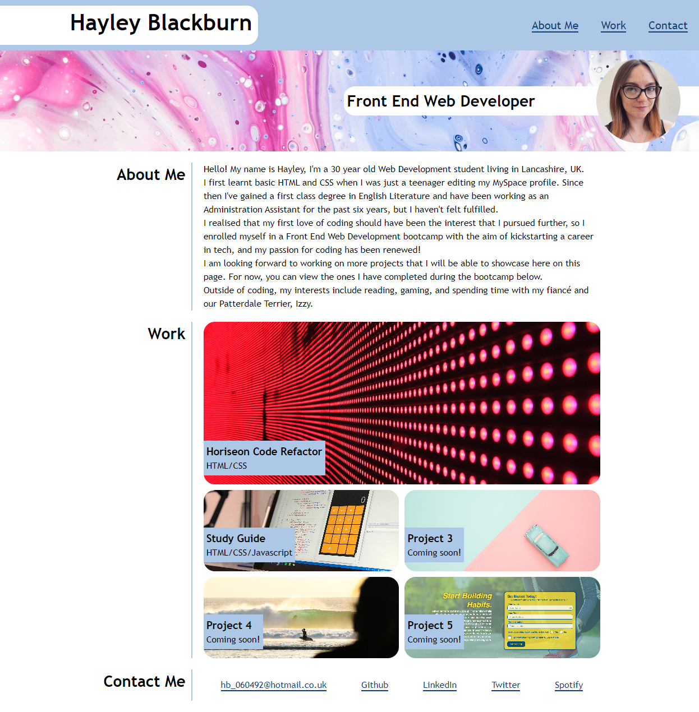

# Portfolio - Hayley Blackburn

## Description
This is my Web Development portfolio, which displays the projects that I have completed, as well as a short introduction to myself and my contact information.

The purpose of the portfolio is to demonstarte my skills to potential employers or clients, and provide a template which I can build upon as I complete more projects and gain more programming knowledge.

The page is built using HTML and CSS only, including the use of flexbox and grids. In the future I plan to add Javascript and more advanced CSS.

[Click Here](https://codenamehaylz.github.io/portfolio/) to see the deployed page.

## Usage

Please click the links at the top of the page to jump to that section. Each project within the 'work' grid is a clickable link which will open a new tab to the deployed project page.

This page is responsive and will display differently on different size screens. 

## License

MIT License.